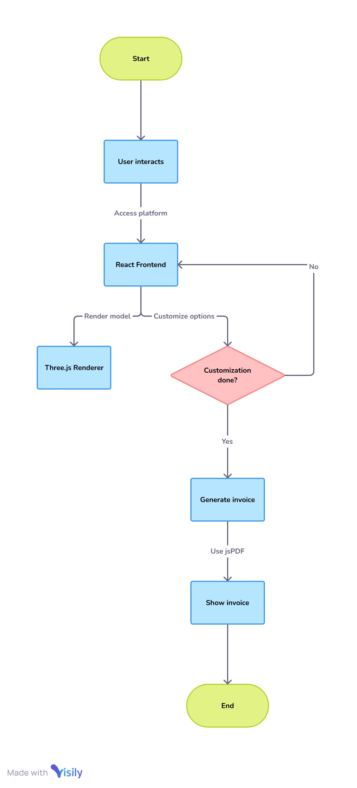
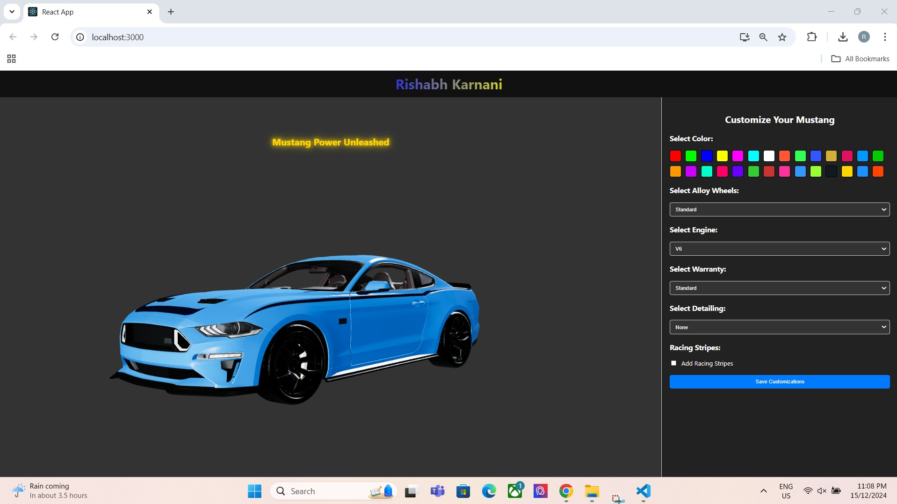
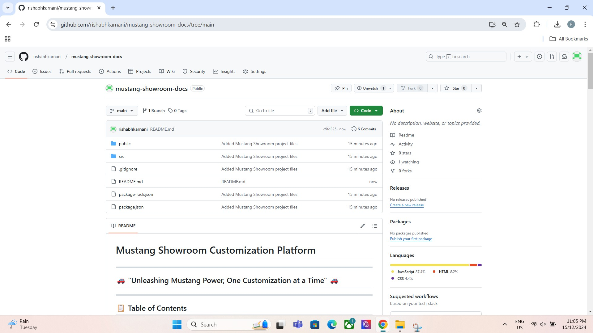
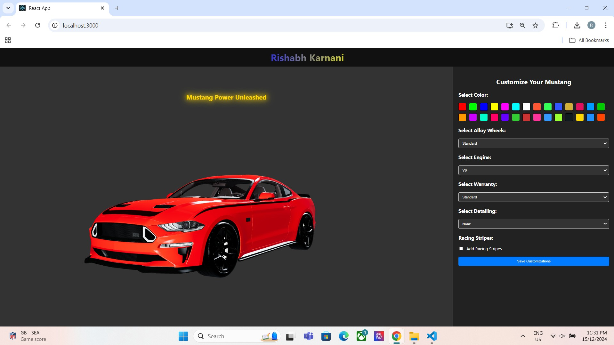
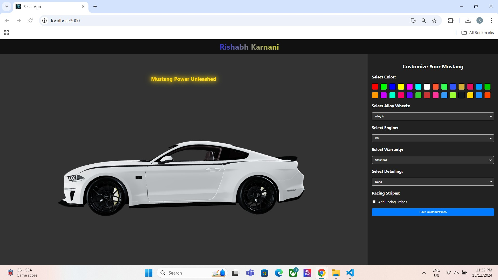
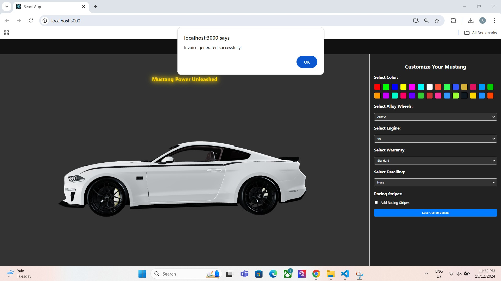
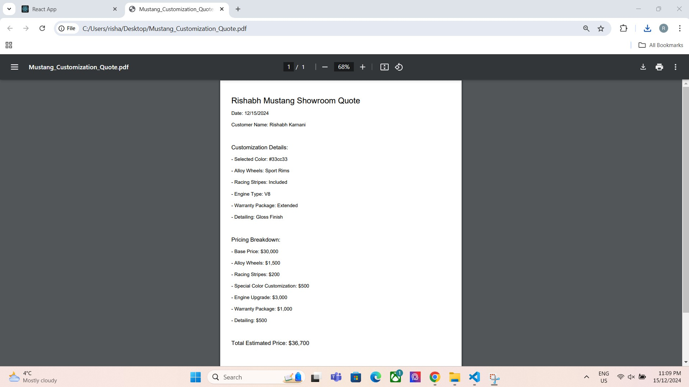

#  **Mustang Showroom Customization Platform**

---

## 🚗 **"Unleashing Mustang Power, One Customization at a Time"** 🚗

---

## 📋 **Table of Contents**
1. [Project Description](#section-1---project-description)
2. [Overview](#section-2---overview)
3. [System Architecture](#section-3---system-architecture)
4. [Data Dictionary](#section-4---data-dictionary)
5. [Data Design](#section-5---data-design)
6. [User Interface Design](#section-6---user-interface-design)
7. [Testing](#section-7---testing)
8. [Monitoring](#section-8---monitoring)
9. [Other Interfaces](#section-9---other-interfaces)
10. [Extra Design Features](#section-10---extra-design-features)
11. [References](#section-11---references)
12. [Glossary](#section-12---glossary)

---

## Section 1 - Project Description

### 🔧 **1.1 Project**
**Project Name:** Mustang Showroom Customization Platform

### 🛠️ **1.2 Description**
The Mustang Showroom Customization Platform is an innovative web-based application that enables users to explore, customize, and visualize a 3D model of a Mustang car. Key features include:
- Dynamic customization of **colors**, **alloy wheels**, **engine types**, and other features.
- A visually engaging **3D viewer** powered by React and Three.js.
- Automatic **PDF invoice generation** with detailed pricing for selected features.

### 📜 **1.3 Revision History**
| **Date**       | **Comment**                            | **Author**          |
|-----------------|----------------------------------------|---------------------|
| 2024-12-01      | Initial draft                         | Rishabh Karnani     |
| 2024-12-03      | Added features and testing details     | Rishabh Karnani     |

---

## Section 2 - Overview

### 🎯 **2.1 Purpose**
The purpose of this application is to revolutionize the car customization experience by allowing users to interact dynamically with a 3D model of the Mustang.

### 📌 **2.2 Scope**
- Real-time customization powered by **React** and **Three.js**.
- High-definition visuals with **HDR lighting**.
- Seamless **PDF invoice generation** summarizing user selections and pricing.

### 📷 **Snapshots**
| **Description**                      | **Screenshot**                                     |
|--------------------------------------|--------------------------------------------------|
| Architecture Diagram                 |    |
| Running Application                  |      |
| GitHub Repository Page               |   |
| Test Case 1                          |                      |
| Test Case 2                          |                      |
| Test Case 3                          |                      |
| Generated PDF File                   |          |

---

## Section 3 - System Architecture

### 🏗️ **3.1 Overview**
The system architecture consists of:
- **3D Viewer Module:** Renders the Mustang in a dynamic 3D environment.
- **Customization Panel:** Provides options for modifying features.
- **Invoice Generator:** Creates PDF estimates based on selected features.

### 📊 **3.2 Architectural Diagram**


---

## Section 4 - Data Dictionary

| **Table**   | **Field**       | **Notes**                         | **Type**    |
|-------------|-----------------|-----------------------------------|-------------|
| CarFeatures | ID              | Unique Identifier                | INTEGER     |
| CarFeatures | Name            | Feature Name (e.g., Color)       | VARCHAR     |
| CarFeatures | Value           | Selected Value                   | VARCHAR     |

---

## Section 5 - Data Design

### 🗂️ **5.1 Persistent/Static Data**
**Entities:**
1. **User Preferences**
   - Attributes: UserID (PK), Color, WheelType, EngineType
   - Relationships: One-to-One with Invoice.
2. **Invoice**
   - Attributes: InvoiceID (PK), UserID (FK), TotalCost

---

## Section 6 - User Interface Design

### 🎨 **6.1 Overview**
The interface consists of two main sections:
1. **3D Viewer Panel:** Displays the Mustang in a 3D interactive environment.
2. **Customization Panel:** Allows users to modify car attributes.

### 🖼️ **6.2 Snapshots**
| **Description** | **Screenshot**                      |
|-----------------|------------------------------------|
| User Interface  |  |

---

## Section 7 - Testing

### ✅ **7.1 Test Plan**
| **Test Case ID** | **Input**          | **Expected Output**                    | **Actual Output** |
|------------------|--------------------|----------------------------------------|-------------------|
| TC-001           | Select "Red" Color | Car changes to red                     | Pass              |
| TC-002           | Select "Alloy A"   | Wheels update to "Alloy A"             | Pass              |
| TC-003           | Generate Invoice   | PDF with correct details is downloaded | Pass              |

### 📷 **Snapshots**
| **Test Case**    | **Screenshot**                      |
|------------------|------------------------------------|
| TC-001           |        |
| TC-002           |        |
| TC-003           |        |

---

## Section 8 - Monitoring

- **Performance Metrics:** Average response time under 1 second.
- **Error Metrics:** Logs for rendering or PDF generation issues.
- **Availability Metrics:** Uptime monitored via browser-based tools.

---

## Section 9 - Other Interfaces

### 🌐 **9.1 External Interfaces**
- **Browser:** For accessing the React application.
- **File System:** For saving generated PDFs.

---

## Section 10 - Extra Design Features

### ✨ **Special Features**
- **HDR Lighting:** Adds realistic rendering to the Mustang model.
- **Dynamic Pricing:** Automatically adjusts invoice totals based on selected options.

---

## Section 11 - References
- [React Documentation](https://reactjs.org/docs/getting-started.html)
- [Three.js Documentation](https://threejs.org/docs/index.html)
- [jsPDF Documentation](https://github.com/parallax/jsPDF)

---

## Section 12 - Glossary

| **Term**           | **Definition**                                      |
|---------------------|----------------------------------------------------|
| **HDR**            | High Dynamic Range                                 |
| **3D Model Viewer**| Component for displaying 3D assets                 |
| **PDF Invoice**    | Document summarizing customization and pricing     |

---

### ✍️ **Author**: *Rishabh Karnani*

---

### **Final Steps**:
1. **Upload all screenshots and docs to your GitHub repository's `docs/` folder.**
2. Verify that all file paths (e.g., `./docs/architecture_diagram.jpg`) are correct.
3. Commit and push the changes:
   ```bash
   git add docs/*
   git commit -m "Added all screenshots, diagrams, and documentation updates"
   git push origin main
